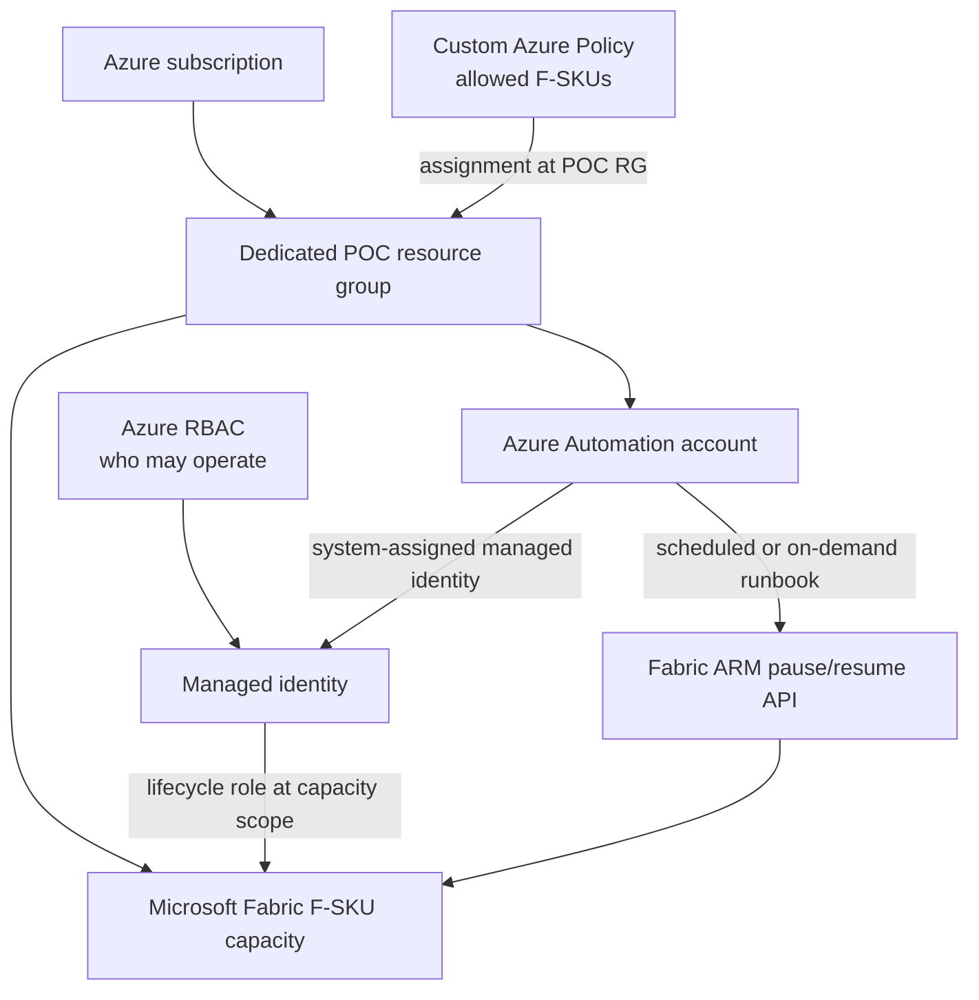

# Microsoft Fabric Capacity Governance POC

A customer-ready reference implementation for governing Microsoft Fabric F-SKU capacities through Azure Resource Manager. It demonstrates lifecycle automation, scoped Azure RBAC, and configurable SKU restrictions with Azure Policy.

The project is safe by default: existing capacities are read-only, new capacity creation requires an explicit flag and is limited to F2, schedules are disabled, policy starts in Audit, cleanup is a dry run, and runtime identifiers stay in ignored local files.

## What this POC demonstrates

- Idempotent status, pause, and resume operations using the stable Fabric ARM API.
- An Azure Automation runbook that authenticates with a system-assigned managed identity.
- A custom lifecycle role assigned at an individual capacity scope.
- Runtime discovery of the Fabric SKU policy alias before policy deployment.
- A configurable allowed-SKU policy assigned only to the POC resource group.
- Sanitized evidence, explicit live-test opt-in, and safe cleanup controls.

## Architecture



See [Architecture](docs/ARCHITECTURE.md) for trust boundaries and request flow.

## Pause/resume automation

The local CLI and Automation runbook first read the capacity state, avoid redundant operations, submit `suspend` or `resume`, honor Azure long-running-operation headers and `Retry-After`, and verify the final resource state. Authentication uses Azure CLI locally and `Connect-AzAccount -Identity` in Automation. No credentials are stored.

```powershell
python scripts/capacity.py status
python scripts/capacity.py pause
python scripts/capacity.py resume
python scripts/run_runbook.py Pause
```

Existing capacities require `ALLOW_EXISTING_CAPACITY_STATE_CHANGE=true` or the CLI's explicit `--force` switch before state changes. POC-created capacities are left paused after validation.

## Azure RBAC

The custom `Fabric Capacity Lifecycle Operator` role contains the four actions currently documented for lifecycle operations:

```text
Microsoft.Fabric/capacities/read
Microsoft.Fabric/capacities/write
Microsoft.Fabric/capacities/suspend/action
Microsoft.Fabric/capacities/resume/action
```

This is not a pause/resume-only permission boundary: `capacities/write` can permit other capacity updates. Assigning the role to one capacity limits its resource scope, while resource-group or subscription assignment expands where those actions apply. See [RBAC guidance](rbac/README.md).

## SKU restriction policy

Deployment queries the active Azure subscription for `Microsoft.Fabric/capacities` aliases and refuses to deploy the policy unless the SKU alias is present. `ALLOWED_FABRIC_SKUS` is configurable; the default is `F2,F4,F8`. The public default effect is Audit. Deny requires the explicit runtime value `POLICY_EFFECT=Deny`.

See [Policy guidance](policy/README.md), including the safe negative-test flow.

## Prerequisites

- An Azure subscription where Microsoft Fabric capacity creation is available.
- Azure CLI authenticated with `az login`.
- Python 3.9 or later.
- Permission to read or create the selected capacity and, for the full POC, create Automation, custom role, and custom policy resources.
- PowerShell is useful for locally parsing the runbook, but is not required to operate the Python CLI.

Install locally:

```powershell
python -m venv .venv
.\.venv\Scripts\Activate.ps1
python -m pip install -r requirements-dev.txt
Copy-Item .env.example .env
```

Populate only the ignored `.env`. Never put real environment values in `.env.example`, documentation, commits, or issue reports.

## Safe deployment

Run preflight first, inspect the dry run, then deploy:

```powershell
python scripts/preflight.py
python scripts/deploy.py --dry-run
python scripts/deploy.py
```

The deployer validates the current CLI context, provider registration, regional F2 eligibility, policy alias, and safety flags. It reuses equivalent resources and records exact created resource IDs in the ignored `results/deployment-manifest.json`. Cleanup requires this manifest; public tags alone are not accepted as ownership proof.

## Existing capacity option

Set:

```dotenv
CAPACITY_MODE=existing
FABRIC_CAPACITY_NAME=<YOUR_CAPACITY_NAME>
ALLOW_EXISTING_CAPACITY_STATE_CHANGE=false
```

The deployer discovers the resource without changing SKU, administrators, or state. Live lifecycle validation is skipped unless state change is explicitly authorized, and an authorized test restores the original state.

## New capacity option

Use a dedicated resource group and set:

```dotenv
CAPACITY_MODE=create
FABRIC_SKU=F2
ALLOW_CAPACITY_CREATION=true
```

The implementation rejects automatic creation above F2. It tags the resource, records ownership locally, and pauses it after validation. Capacity usage can still incur charges; review current Azure pricing before deployment.

## Running the POC

Useful entry points:

| Command | Purpose |
|---|---|
| `python scripts/preflight.py` | Authentication, configuration, provider, and eligibility checks |
| `python scripts/deploy.py --dry-run` | Preview the orchestration path |
| `python scripts/deploy.py` | Deploy or reconcile enabled controls |
| `python scripts/capacity.py status` | Read the selected capacity |
| `python scripts/run_runbook.py Resume` | Exercise Automation, managed identity, RBAC, and Fabric API end to end |
| `python scripts/discover_policy_aliases.py` | Query and verify live Fabric aliases |
| `python scripts/validate.py` | Run configured live validation suites |
| `python scripts/validate.py --policy-negative-test` | Attempt the safe Deny test; requires explicit Deny configuration |
| `python scripts/sanitize_results.py` | Produce shareable copies of runtime evidence |
| `python scripts/check_public_repo.py` | Scan files and Git history for public-release hazards |

Schedules are optional. Set an explicit `AUTOMATION_TIME_ZONE`, set the times, and then enable `ENABLE_SCHEDULES=true`. See [Pause/resume details](docs/PAUSE_RESUME.md).

## Validation

Offline checks do not need Azure credentials:

```powershell
python -m pytest tests/unit -q
python -m ruff check .
python -m bandit -r src scripts -ll -ii
python -m pip_audit -r requirements.txt --progress-spinner off
python scripts/check_public_repo.py --include-history
```

Live integration tests are separated and intentionally skipped unless enabled:

```powershell
$env:RUN_AZURE_INTEGRATION_TESTS='true'
python -m pytest tests/integration -m integration -q
```

Runtime output may contain identifiers and is written under ignored `results/`. Only sanitized examples belong under `docs/sample-output/`. Actual evidence from the reference run is summarized in [POC findings](docs/POC_FINDINGS.md).

## Cleanup

Preview only:

```powershell
python scripts/cleanup.py
```

Deletion requires both `ALLOW_POC_RESOURCE_DELETION=true` and `--confirm`:

```powershell
python scripts/cleanup.py --confirm
```

The cleanup command protects existing capacities and requires exact manifest records plus matching deployment tags. Use `--keep-capacity` to preserve and pause a POC-created capacity.

## Security and public-repo considerations

Environment configuration, Azure CLI caches, deployment output, results, and state files are ignored. The repository scanner checks the worktree, index, and reachable Git history for identifiers, credentials, private keys, connection secrets, and email addresses. Review [Public repository security](docs/SECURITY_PUBLIC_REPO.md) before publishing or sharing output.

See the [independent security audit](docs/SECURITY_AUDIT.md) for the reviewed findings, remediations, and verification evidence behind the current baseline.

An existing Automation account is protected in the same way as an existing capacity. Unless the manifest and live tags prove POC ownership, the deployer refuses to enable its identity or replace the named runbook. Review the account and set `ALLOW_EXISTING_AUTOMATION_MODIFICATION=true` only when that modification is intentional.

## Limitations

- Azure RBAC governs ARM operations; it is distinct from Fabric tenant, workspace, or admin roles.
- The documented lifecycle permission set includes `capacities/write`, so it cannot honestly be described as pause/resume-only.
- Azure Policy applies to ARM create/update requests in its assignment scope; it does not replace RBAC or Fabric governance.
- Policy compliance evaluation may be delayed even though Deny is evaluated during a matching request.
- Schedules are daily and do not model holidays, maintenance windows, or workload-aware shutdown.
- Azure service availability, API versions, aliases, quota, and pricing can change; rerun preflight and alias discovery.

## Microsoft documentation

- [Pause and resume a Fabric capacity](https://learn.microsoft.com/fabric/enterprise/pause-resume)
- [Fabric capacities REST API](https://learn.microsoft.com/rest/api/microsoftfabric/fabric-capacities)
- [Create or update a capacity](https://learn.microsoft.com/rest/api/microsoftfabric/fabric-capacities/create-or-update?view=rest-microsoftfabric-2023-11-01)
- [List eligible Fabric SKUs](https://learn.microsoft.com/rest/api/microsoftfabric/fabric-capacities/list-skus?view=rest-microsoftfabric-2023-11-01)
- [Azure Policy overview](https://learn.microsoft.com/azure/governance/policy/overview)
- [Azure Policy aliases](https://learn.microsoft.com/azure/governance/policy/concepts/definition-structure-alias)
- [Azure Automation managed identity](https://learn.microsoft.com/azure/automation/enable-managed-identity-for-automation)

## Using an AI coding agent with this repo

The reusable [coding-agent prompt](docs/LLM_AGENT_PROMPT.md) directs an agent to preserve the safeguards, verify current Microsoft documentation and aliases, use only ignored runtime configuration, run tests, and report verified evidence separately from implementation.

## License

MIT. See [LICENSE](LICENSE).
