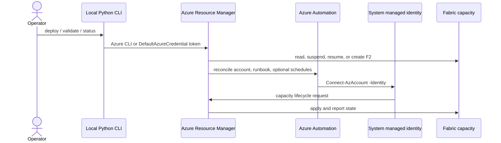

# Architecture

## Components

Azure Policy is evaluated by Azure Resource Manager during matching create/update requests. Azure RBAC authorizes the calling identity. The two controls are deliberately separate.

## Scopes

- The Fabric capacity and Automation account live in a dedicated resource group.
- The reusable custom role definition exists at subscription level because Azure role definitions need an assignable scope.
- The Automation identity receives that role only at the individual capacity resource.
- The custom policy definition exists at subscription level, while its assignment is limited to the POC resource group.
- Runtime ownership is proved by an ignored manifest containing exact IDs plus matching live tags with a random deployment identifier.

## Existing-capacity path

An existing capacity is discovered and read without mutation. If lifecycle testing is explicitly authorized, the validator captures the original state, runs the test, and restores that state. SKU and administrators are never changed by this path. Cleanup never deletes an existing capacity.

## Create path

Creation requires both `CAPACITY_MODE=create` and `ALLOW_CAPACITY_CREATION=true`. The library independently rejects a requested size larger than F2. The created capacity receives non-identifying POC tags and a runtime provenance tag, and is paused when testing finishes.

## Failure behavior

- Authentication and configuration failures stop before deployment.
- A missing SKU policy alias stops policy deployment only; no alias is invented.
- ARM calls retry throttling and transient server errors with bounded backoff.
- Long-running operations honor polling headers; if a narrowly scoped identity cannot read a provider-level operation URL, lifecycle code falls back to polling the capacity state.
- Cleanup performs no mutation unless two explicit deletion gates are present and ownership is proven.
